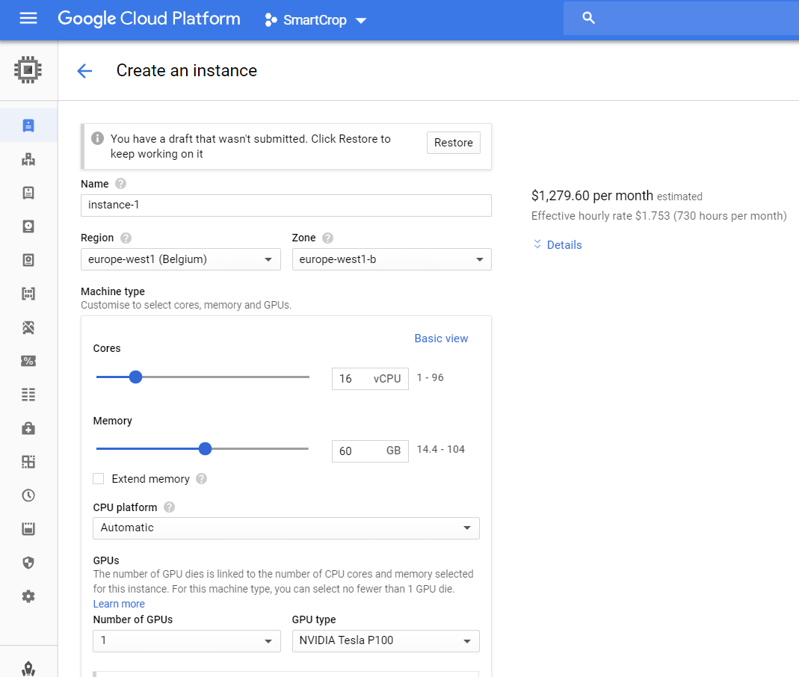
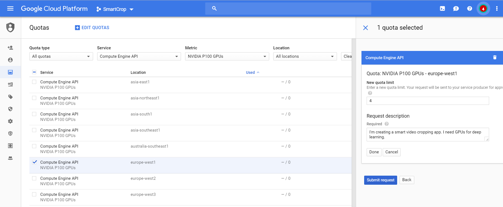
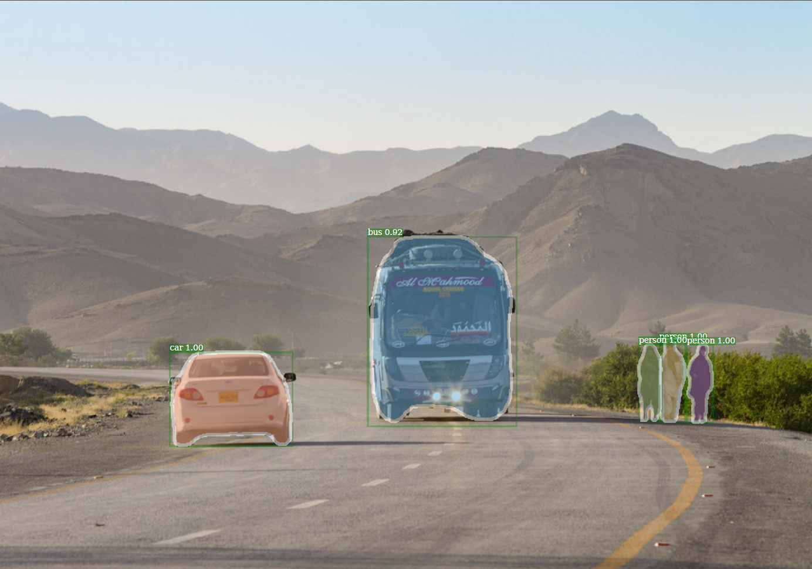

# Install a detectron instance


## Goocle cloud

Go to Google cloud console and create a new project: https://console.cloud.google.com

Prices: https://cloud.google.com/compute/docs/gpus/

Guide: https://cloud.google.com/compute/docs/gpus/add-gpus

Add shh key to the project metadata.


## Create a VM with GPU


project -> compute engine -> vm instances



Add a 200 GB ssd disk.

We need to make a quota request for GPU
https://cloud.google.com/compute/quotas#requesting_additional_quota



Add a static external IP to VM. Go to VPC Network -> External IP addresses and change the type of the IP to static.

Modify your hosts file to map the static IP to an URL.
Connect with ssh: $ssh -i /path/to/private/key <name>@<URL>

## Install GPU drivers

Following https://linuxconfig.org/how-to-install-the-nvidia-drivers-on-ubuntu-18-04-bionic-beaver-linux

Automatic Install using standard Ubuntu Repository

```Bash
$sudo apt-get update

# update your common drivers
$ sudo apt install ubuntu-drivers-common

# Install the driver(s)
$ sudo ubuntu-drivers autoinstall

# Reboot
$ sudo reboot
```

Et voilà !

## Install docker

https://docs.docker.com/install/linux/docker-ce/ubuntu/

```Bash
sudo apt-get install \
    apt-transport-https \
    ca-certificates \
    curl \
    software-properties-common
curl -fsSL https://download.docker.com/linux/ubuntu/gpg | sudo apt-key add -
sudo add-apt-repository \
   "deb [arch=amd64] https://download.docker.com/linux/ubuntu \
   $(lsb_release -cs) \
   stable"
sudo apt install docker.io
sudo usermod -aG docker $USER
exit
docker run hello-world
```

## Install NVIDIA doocker

https://github.com/NVIDIA/nvidia-docker

```Bash
# If you have nvidia-docker 1.0 installed: we need to remove it and all existing GPU containers
docker volume ls -q -f driver=nvidia-docker | xargs -r -I{} -n1 docker ps -q -a -f volume={} | xargs -r docker rm -f
sudo apt-get purge -y nvidia-docker

# Add the package repositories
curl -s -L https://nvidia.github.io/nvidia-docker/gpgkey | \
  sudo apt-key add -
distribution=$(. /etc/os-release;echo $ID$VERSION_ID)
curl -s -L https://nvidia.github.io/nvidia-docker/$distribution/nvidia-docker.list | \
  sudo tee /etc/apt/sources.list.d/nvidia-docker.list
sudo apt-get update

# Install nvidia-docker2 and reload the Docker daemon configuration
sudo apt-get install -y nvidia-docker2
sudo pkill -SIGHUP dockerd

# Test nvidia-smi with the latest official CUDA image
docker run --runtime=nvidia --rm nvidia/cuda nvidia-smi
```


## Install detectron

https://github.com/facebookresearch/Detectron/blob/master/INSTALL.md

```Bash
mkdir projects/smartcrop/lib/
cd projects/smartcrop/lib/
git clone https://github.com/facebookresearch/Detectron.git
cd Detectron/docker/
docker build -t detectron:c2-cuda9-cudnn7 .
cd ~/projects/smartcrop/lib/Detectron
nvidia-docker run --name cropdude -d -it -v $PWD/demo:/detectron/demo detectron:c2-cuda9-cudnn7

# log to the container
nvidia-docker exec -it cropdude /bin/bash

# test the installation
python2 tools/infer_simple.py \
    --cfg configs/12_2017_baselines/e2e_mask_rcnn_R-101-FPN_2x.yaml \
    --output-dir ./demo/output \
    --image-ext jpg \
    --wts https://s3-us-west-2.amazonaws.com/detectron/35861858/12_2017_baselines/e2e_mask_rcnn_R-101-FPN_2x.yaml.02_32_51.SgT4y1cO/output/train/coco_2014_train:coco_2014_valminusminival/generalized_rcnn/model_final.pkl \
    demo
```

You now have smartly cropped images in `./demo/output`.




## Notes
````Bash
Generating a new Secure Boot signing key:
Generating a 2048 bit RSA private key
................................+++
................................................+++
writing new private key to '/var/lib/shim-signed/mok/MOK.priv'
```
