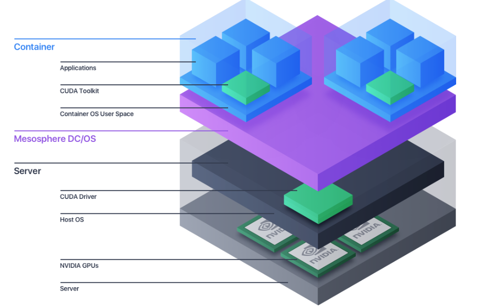

# Mesosphere DCOS

https://mesosphere.com/blog/accelerating-machine-learning-with-gpus-and-dcos/

DC/OS 1.9 introduced GPU-based scheduling.
DC/OS detects all GPUs on the cluster. GPU-based scheduling allows machine learning applications to request GPU resources similar to CPU, memory, and disk resources, and once those GPU resources are allocated to the app, DC/OS and Mesos resource isolation guarantees that the application has full and dedicated access to those resources, avoiding oversubscription. Applications can then release those GPU resources when done, or scale out to more GPUs that are available.

https://docs.mesosphere.com/1.9/deploying-services/gpu/
